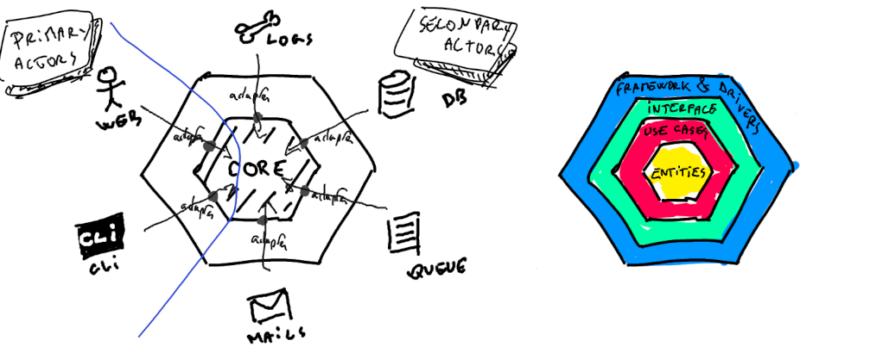
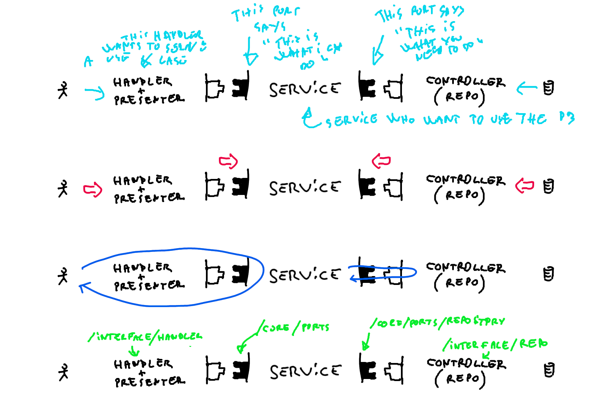

```
This repo is a work in progress - last edit 27/10/2022
```

I feel post-OOP languages are doing great implementing ports and adapters in an Hexagonal Architecture. In this article I want to give it a try. I want to tackle some issues I've had implementing it, and to highlight some parts that I feel are missing in most articles I found. 

I have a few years working with servers in NodeJS. I've put a lot of energy into building/maintaining/massively refactoring them. Though I am rather new in Go. For this reason you should 1/ be caeful about what you read here and 2/ share your knowledge and participate.

This article uses the words "Clean architecture", "Hexagonal architecture" and "Ports & Adapters pattern" as synonyms.

# Clean go architecture 🛡️

There are a lot of resources online describing the core principles of Hexagonal Architecture, and a lot of ressources on how to implement it in Go. They are great. But because they aim at senior developers, I feel they somehow fail at answering the most basic real-life implementation questions: how the heck do I send emails ? Where do I put my middlewares ? How do I make requests to other services ? How do I implement a queue ? Should I turn everything into an Actor ? Or is it ok to import librairies ?

This repo aims at answering those questions questions and to achieve buiding a stable, flexible, scalable, highly available REST API in Go. It won't be achieved on the first shot.

This repo is a stanalone server, it asumes it exists behind a gateway.

# Why choosing Go ❓

According to Go's FAQ, "[Before Go], one had to choose either efficient compilation, efficient execution, or ease of programming; all three were not available in the same mainstream language. [...] Go addressed these issues [...]. It also aimed to be modern, with support for networked and multicore computing".

It's safe to say they did a great job at it. We can also mention the standard library is very good (including the http library) and easy to extend.

In short, Go is a first class language to pick when building a server.

# Why choosing hexagonal ❓

According to it's author, the ports and adapters architecture exists to inforce isolation of the application's components by design, so they can be developed and tested in isolation from its run-time devices and databases. Easy.

- It helps you focus on the business rules,
- It helps you to build a technology-agnostic application,
- It allows you to run tests in isolation,
- It clarifies who does what (each component have a well defined perimeter).

On the 'bad side' it surely is more technical than other patterns.

# Ports and Adapters architecture 🔌

So this architecture is about isolating the core business.

To achieve isolation, everything that is not pure business logic, types or models, and is either using the application (a Primary Actor, driving the application) or used by the application (a secondary actor, driven by the application) is just removed from the core and pushed away to the surounding Framework layer. 

Then, all communication between those actors and the application is achieved through Ports and Adapters.

Ports are exposed by the core. Adapters either call the core through actions defined by the ports (Primary adapters), or implement actions defined by the port (Secondary adapters).

If you already read about this pattern, chances are you came accross a diagram like this:



Notice how:
- Everything that is not part of the core business, types or models is pushed outside,
- All actors are all equally treated,
- The core do not adapt to actors, actors adapt to the core.

It is worth to mention the name hexagon comes from the idea that each side should expose a port. In real life though this would most likely be an n-gon, since you will probably never have exactly 6 ports...

## ☠️ Responsibility for each layer ☠️

"Entities" together with "Use cases" define the core.

### The "Entities" layer

### The "Use-Cases" layer

- Entities
- The "use cases" layer contains the business logic (services) and it's ports. The services should never receive the full request object. Each service is a  They should receive anything they need to call (secondary actors). The ports are interfaces that must define actions a Primary Actor can call, or actions a secondary actor must implement.

### The "Interface" layer

### The Drivers & Frameworks layer

## Dependency injection 💉

This architecture relies heavily on dependency injection, meaning each layer receives the objects it can call. Notice how all dependencies point inward. Which means outside layers depend on the inside layers. Which means a file in an inner circle never import a file from an upper level. If it does, something probably failed.

One might be tempted to inject dependencies


## Zoom on a slice

...todo



...todo

# The folder structure 📁

The structure of folders should reflect the separation between each layer. What I propose here is the result of many hours of thinking and refactoring, but it is not definitive and could benefit some external opinion.

```
root
├── cmd -------------------> contains entry points for the program
|   └── httpserver --------> calls httpserver.Start()
├── internal --------------> private application code
|   ├── core --------------> contains all the business logic (models, services, ports).
|   |   ├── domain
|   |   ├── ports
|   |   └── services
|   ├── infrastructure ----> contains all secondary actors, pproviders, the router and the registry.
|   └── interface ---------> contains the interface layer (repository, handlers, middlewares).
├── pkg -------------------> shared code, library-wrappers...
├── .env ------------------> secrets
└── Makefile
```

Note you will find advanced informations on how to structure your project here: https://github.com/golang-standards/project-layout

### How it maps to the layers

As mentioned above, each folder maps to a specific layer:
| Folder         | Layer                |
|----------------|----------------------|
| core > domain  | Entities             |
| core > service | Use cases            |
| interface      | Adapters             |
| infrastructure | Frameworks & Drivers |

Note Entities, Use cases and Ports are grouped in the same folder since they all are part of the business logic

## Create an entity

## Create an entity port

## Create a service

## Create a service port

## Create a controller

## Use a registry to  connect ports and adapters together 

## Use a router for http requests

## Create a middleware

## Connect a database

## Connect a new secondary actor

## Unitests 🧪

## How to create a new service

## How to create a new use case ? endpoint + handler

## Pub/Sub Workers

## Queues and workers

## Chron jobs ⏰

## Secrets 🤐

## Docker 🐋

## External ressources

### About Go & 

- Go best practises by Uber https://github.com/uber-go/guide 
- Go standards on how to structure a project: https://github.com/golang-standards/project-layout


- The original article about hexaagonal architectur from Alistair Cockburn: https://alistair.cockburn.us/hexagonal-architecture/
- The Twelve-Factor App: https://12factor.net/
- A clean implementation in Go by Matías Varela: https://medium.com/@matiasvarela/hexagonal-architecture-in-go-cfd4e436faa3
