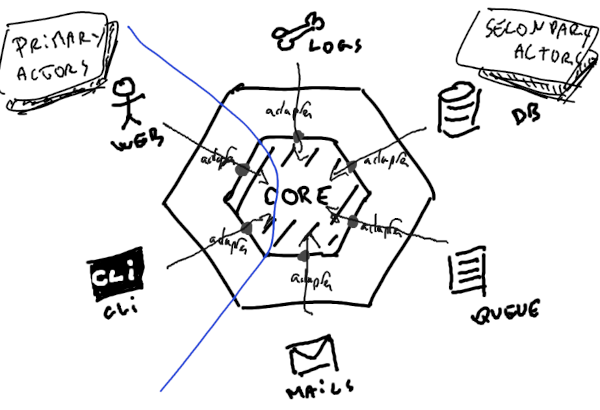

# Clean go architecture 🛡️

Post-OOP languages are doing great implementing ports and adapters in an hexagonal architecture. There are a lot of resources online describing the core principles of hexagonal architecture, and a lot of ressources on how to implement it in Go. They are great. But because they aim at senior developers, I feel they somehow fail at answering the most basic real-life implementation questions: how the heck do I send emails ? Logs ? Where do I put my middlewares ? How do I make request to other services ? How do I implement a queue ?

This repo aims at answering this question: how to achieve buiding a stable, flexible, scalable, highly available REST API in Go.

I have years of experience building NodeJS servers. I've put a lot of pain and suffering (for good) building/maintaining/refactoring them. Though I am rather new in Go. This is why I'm trying to involve more experienced developers to this project, and you should feel free to share your experience and participate in this project.

## Why Go, and why hexagonal ❓

### Why choosing Go

According to Go's FAQ, "One had to choose either efficient compilation, efficient execution, or ease of programming; all three were not available in the same mainstream language. [...] Go addressed these issues [...]. It also aimed to be modern, with support for networked and multicore computing".

It's safe to say they nailed it.

Go maximizes ease to code, efficiency and low compile time. Additionaly one can feel it really was written for the web. Also the standard library is so good it makes using third party libraries useless in most cases, allowing you to achieve next-to-zero dependencies.

In short this is a first class language to pick when building a server.

### Why choosing hexagonal 

According to it's author, the ports and adapters architecture exists for a reason: to inforce isolation of the application's components by design, so they can be developed and tested in isolation from its run-time devices and databases. Easy.

## Ports and Adapters 🔌

If you already read about ports and adapters architecture, chances are you came accross a diagram like this already:



If you remember, the architecture is there to inforce separation between the core of the business rules (entities, such a models, types... and use cases, i.e. services) and any implementation details (interface and drivers).

One thing to notice is how everything that is not part of the core business is simply thrown out of the inner circle. All actors (humans, clis, other srvices, databases, search indexes, third party email or log platform) is treated as an external entity, that can only drive the system (primary actors) or be driven by the system (secondary actors) through ports. The only difference here being that ports for primary actors .... and ports for secondary actors ..... .

So in the core, we roughly have models, services, and both of them expose ports to the outside. Handlers are just using those ports to drive the system or implement their rules to be driven by it. Easy peasy.

## The folder structure 📁

The structure of folders should reflect the separation between each layer. What I propose here is the result of many hours of thinking and refactoring, but it is not definitive and could benefit some external opinion.

```
root
├── cmd -------------------> contains entry points for the program
|   └── httpserver --------> calls httpserver.Start()
├── internal --------------> private application code
|   ├── core --------------> contains all the business logic (models, services, ports).
|   |   ├── domain
|   |   ├── ports
|   |   └── services
|   ├── infrastructure ----> contains all secondary actors, pproviders, the router and the registry.
|   └── interface ---------> contains the interface layer (repository, handlers, middlewares).
├── pkg -------------------> shared code, library-wrappers...
├── .env ------------------> secrets
└── Makefile
```

Note you will find advanced informations on how to structure your project here (technology agnostic): https://github.com/golang-standards/project-layout

### How it maps to the layers

As mentioned above, each folder maps to a specific layer:
| Folder         | Layer                |
|----------------|----------------------|
| core > domain  | Entities             |
| core > service | Use cases            |
| interface      | Adapters             |
| infrastructure | Frameworks & Drivers |

Note Entities, Use cases and Ports are grouped in the same folder since they all are part of the business logic

## ☠️ Responsibility for each layer ☠️

## Use a registry to  connect ports and adapters together 💉

## Create middlewares

## Connect a database

## Connect a new secondary actor

## Unitests 🧪

## How to create a new service

## How to create a new use case ? endpoint + handler

## Pub/Sub Workers

## Queues and workers

## Chron jobs ⏰

## Secrets 🤐

## Docker 🐋

## External ressources

- The original article about hexaagonal architectur from Alistair Cockburn: https://alistair.cockburn.us/hexagonal-architecture/
- The Twelve-Factor App: https://12factor.net/
- Go standards on how to structure a project: https://github.com/golang-standards/project-layout
- A clean implementation in Go by Matías Varela: https://medium.com/@matiasvarela/hexagonal-architecture-in-go-cfd4e436faa3
